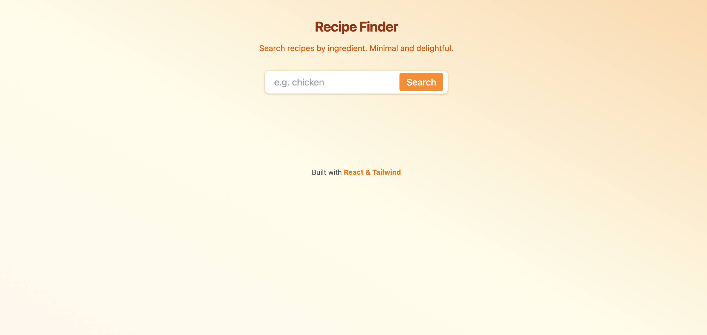
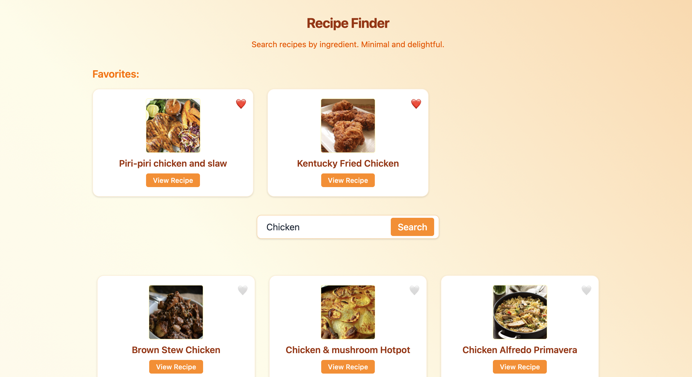

# Recipe Finder — Modern React + Tailwind

A cheerful, minimal app for discovering recipes by ingredient—built for humans, with help from AI!

---

## Demo

---

## Screenshots

---

## Features

- 🍽️ **Ingredient Search:** Find recipes by what’s in your kitchen.
- 💡 **Autosuggest:** Instant ingredient suggestions for less typing & smarter searches.
- ❤️ **Favorites:** Click the heart to save recipes you love—your shortlist appears instantly.
- ⚡ **Live API:** Fetches real recipes using TheMealDB API.
- 🟠 **Responsive UI:** Beautiful on mobile, tablet, and desktop.
- 🔔 **Toast Notifications:** Clear feedback for all actions and errors.
- 🤖 **Built with AI Guidance:** Code, design, and debugging improved through ChatGPT collaboration.

---

## Installation

Clone the repo
git clone https://github.com/your-username/recipe-finder.git
cd recipe-finder

Install dependencies
npm install

Start the development server
npm run dev

text

Open `http://localhost:5173` (or as shown in the terminal).

---

## Usage

- Type an ingredient (e.g., `chicken`) into the search box.
- See autosuggested ingredients and click one for instant search.
- Click **Search** or press **Enter**—view recipes as cards.
- Click the 🧡 heart icon to favorite a recipe—see your favorites at the top!
- Click "View Recipe" to open full instructions on TheMealDB.

---

## Contributing

Got ideas or spotted a bug?  
Open an issue or pull request—human kindness and code clarity are always welcome!

---

## AI Interaction Log

This project was built in partnership with ChatGPT!  
See [`AI-Conversation.md`](AI-Conversation.md) in the repo to follow my step-by-step learning, debugging, and design process.

---

## License

MIT

---

## Acknowledgments

- [TheMealDB API](https://www.themealdb.com/api.php)
- TailwindCSS team
- OpenAI for conversational learning and code review
